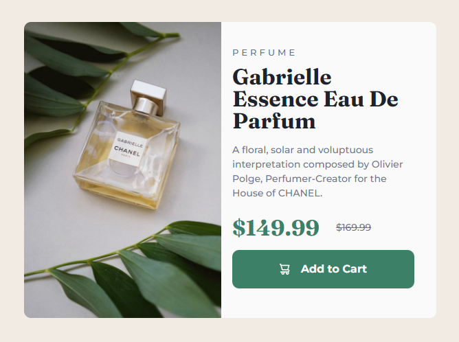

# Frontend Mentor - Product preview card component solution


This is a solution to the [Product preview card component challenge on Frontend Mentor](https://www.frontendmentor.io/challenges/product-preview-card-component-GO7UmttRfa). Frontend Mentor challenges help you improve your coding skills by building realistic projects. 

## Table of contents

- [Overview](#overview)
  - [The challenge](#the-challenge)
  - [Screenshot](#screenshot)
  - [Links](#links)
- [My process](#my-process)
  - [Built with](#built-with)
  - [Continued development](#continued-development)
  - [Useful resources](#useful-resources)
- [Author](#author)

## Overview

### The challenge

Users should be able to:

- View the optimal layout depending on their device's screen size
- See a hover state for interactive elements

### Screenshot



This is how the desktop view looks like!

### Links

- Live Site URL: [Github pages](https://albana-meloni.github.io/product-card/)

## My process

### Built with

- Semantic HTML5 markup
- SASS advantages (map, extend, nesting)
- Flexbox
- Mobile-first workflow

### Continued development

I struggled with the image on desktop view, I had to play with the content's width so the image would place the correct way. I couldn't find an easy way to solve it. I'm going to keep practising!!

### Useful resources

- [Change image](https://es.stackoverflow.com/questions/445501/como-cambiar-imagen-seg%C3%BAn-resoluci%C3%B3n) - This helped me for change the product image depending on the screen's width. I really liked this way to solve it and will use it going forward.

```html
<picture>
    <source srcset="desktop.jpg" media="(min-width: 1024px)">
    <source srcset="tablet.jpg" media="(min-width: 768px)">
    <source srcset="mobile.jpg" media="(min-width: 377px)">
     <!-- main image -->
</picture>
```

## Author

- [Frontend Mentor](https://www.frontendmentor.io/profile/albana-meloni)
- [LinkedIn](https://www.linkedin.com/in/albana-meloni-203927238/)


**Thanks for reading, I hope you enjoy my code ;)**